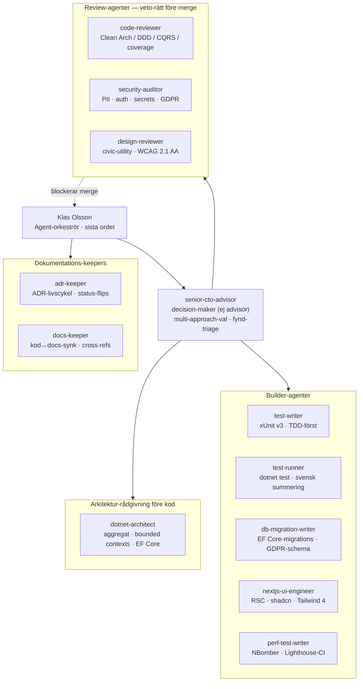
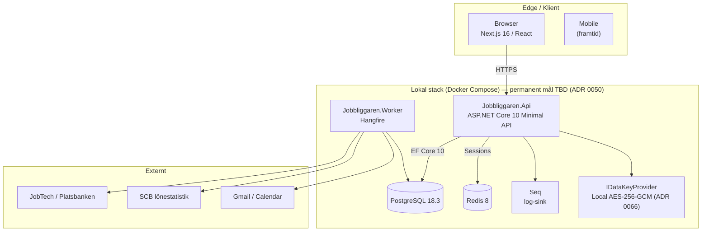
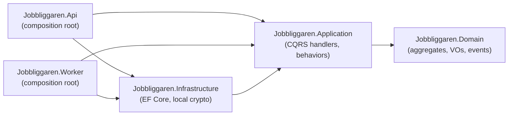

# Jobbliggaren

> **Svensk jobbansökningshanterare byggd som civic utility — och ett portfolio-bevis på agent-orkestrerad ingenjörsdisciplin.**
> Platsbanken-integration, deterministisk CV-granskning och matchningsmotor, end-to-end pipeline-tracker.
> Clean Architecture med maskinellt verifierade lager-gränser, dataminimering och fält-kryptering, GDPR-säker by default.

[](https://dotnet.microsoft.com/)
[](https://learn.microsoft.com/dotnet/csharp/)
[](https://nextjs.org/)
[](https://www.typescriptlang.org/)
[](https://www.postgresql.org/)
[-2C3E50)](docs/decisions/0066-aws-dev-stack-teardown-semester-pause.md)
[](docs/decisions/0001-clean-architecture.md)
[](docs/decisions/0044-test-coverage-policy.md)
[](docs/decisions/0044-test-coverage-policy.md)
[](docs/decisions/0044-test-coverage-policy.md)
[](docs/decisions/README.md)
[](#status)
[](LICENSE)

---

## Snabblänkar

- [Vad är Jobbliggaren](#vad-är-jobbliggaren)
- [Om utvecklingsmodellen](#om-utvecklingsmodellen)
- [Agent-orkestrering](#agent-orkestrering)
- [Ingenjörsprinciper i praktiken](#ingenjörsprinciper-i-praktiken)
- [Position och anti-position](#position-och-anti-position)
- [Funktioner](#funktioner)
- [Arkitektur](#arkitektur)
- [Kvalitet, test och coverage](#kvalitet-test-och-coverage)
- [Tech-stack](#tech-stack)
- [Komma igång lokalt](#komma-igång-lokalt)
- [Projekt-struktur](#projekt-struktur)
- [Vanliga kommandon](#vanliga-kommandon)
- [Miljöer](#miljöer)
- [Säkerhet och GDPR](#säkerhet-och-gdpr)
- [Status](#status)
- [Dokumentation](#dokumentation)
- [Författare](#författare)
- [Licens](#licens)

---

## Vad är Jobbliggaren

Jobbliggaren är en jobbsök- och ansökningshanterare för den svenska arbetsmarknaden. Appen kombinerar JobTech/Platsbanken-integration med deterministiska, förklarbara motorer för CV-granskning och jobbmatchning — medvetet positionerad som en *civic utility*, ett verktyg som signalerar tillit och pålitlighet snarare än hajp.

Målet är att stressade jobbsökare får ett verktyg som känns som en förlängning av svensk offentlig digital service (1177, Försäkringskassan, Digg) snarare än ett av hundra produkter som alla ser likadana ut. Den medvetna icke-differentieringen är ett designval, inte en brist på ambition.

> [!NOTE]
> Detta repo är publikt synligt för portfölj-syfte. Det är ett **pågående arbete** i pre-MVP-fas — kärn-domänen, Platsbanken-integrationen och ansökningshanteringen är på plats; CV-motorn och matchningsmotorn är under uppbyggnad. README beskriver det faktiska tillståndet, inte ett mål-tillstånd.

---

## Om utvecklingsmodellen

Jag har byggt Jobbliggaren med **Claude Code som primär utvecklingspartner** i en agent-orkestrerad modell — inte "AI som autocompletear", utan en governance-struktur där specialiserade review-agenter har veto-rätt, en CTO-agent är decision-maker vid arkitektur-tradeoffs, och varje arkitekturbeslut historieförs som en immutable ADR. Modellen är dokumenterad i sin helhet i [`CLAUDE.md §9`](CLAUDE.md) och verifierbar mot katalogen [`.claude/`](.claude/).

Positionen jag tränar i detta projekt: **AI-Augmented Fullstack Engineer med fokus på agent-orkestrering** över .NET, React och TypeScript. Differentiatorn är inte att AI används i utvecklingsflödet — det gör många. Differentiatorn är att flödet har *granskningsspärrar, beslutsdisciplin och spårbarhet* som håller för en kodgranskning på Mastercard-nivå. Resten av denna README är evidensen för det påståendet.

---

## Agent-orkestrering

Jobbliggaren kör **PR-flöde mot skyddad `main` med CI-gate** ([ADR 0065](docs/decisions/0065-pr-flow-restoration-with-ci-gate.md)). Granskningsvärdet förstärks av en orkestrerad agent-struktur med skrivna mandat. Roster verifierad i [`.claude/agents/`](.claude/agents/): specialiserade agenter med distinkta, icke-överlappande mandat.



### Modellen i sex steg

1. **Plan-design** — scope, sekvens, risker och alternativ designas i chat innan kod skrivs. Ingen kod utan plan.
2. **STOPP-disciplin** — Claude Code stannar vid varje övergång. Inga `str_replace`, inga commits, ingen analys mellan STOPP och GO ([CLAUDE.md §6](CLAUDE.md)).
3. **Agent-veto** — `code-reviewer`, `security-auditor` och `design-reviewer` har **blockerande** veto vid relevant scope. En review-agents auktoritet är skriven regel (CLAUDE.md), inte konsensus eller deadline.
4. **In-block-fix-disciplin** — fynd fixas i samma commit-batch som default. Teknisk skuld lyfts endast vid genuin fas- eller dependency-orsak ([CLAUDE.md §9.6](CLAUDE.md)) — TD-listan är inte ett dumpningsställe.
5. **ADR-historik** — alla arkitekturbeslut är immutable ADRs. En ändring skapar en ny ADR som *superseder* den gamla, aldrig en tyst redigering ([docs/decisions/](docs/decisions/)).
6. **Session-protokoll** — varje session börjar med state-verifiering + git-log-kontroll och avslutas med synkroniserad docs-state ([CLAUDE.md §1.5](CLAUDE.md)).

Detta är governance-mognad — inte "jag använder AI". Agent-rapporterna sparas i [`docs/reviews/`](docs/reviews/) och bifogas varje PR så att granskning sker parallellt.

---

## Ingenjörsprinciper i praktiken

Den här sektionen är portfolions kärna. Varje princip nedan är kopplad till en **verifierbar mekanism** — ett arkitekturtest som failar bygget, en ADR som låser beslutet, eller en namngiven kod-path. Inga påståenden utan referent.

### Clean Architecture — maskinellt enforced, inte beskrivet

De flesta kodbaser *beskriver* sin lager-separation. Jobbliggaren **failar bygget** om den bryts. [`Jobbliggaren.Architecture.Tests`](tests/Jobbliggaren.Architecture.Tests/) innehåller **78 NetArchTest-fakta över 14 filer** som körs i CI. Den hårdaste regeln, `DomainLayerTests.Domain_should_not_depend_on_any_other_project`, asserterar att domänlagret har noll beroende på EF Core, ASP.NET Core, Mediator, FluentValidation eller något högre lager:

```csharp
// tests/Jobbliggaren.Architecture.Tests/DomainLayerTests.cs
Types.InAssembly(typeof(Jobbliggaren.Domain.Common.Entity<>).Assembly)
    .ShouldNot()
    .HaveDependencyOnAny(
        "Microsoft.EntityFrameworkCore", "Microsoft.AspNetCore",
        "Mediator", "FluentValidation",
        "Jobbliggaren.Application", "Jobbliggaren.Infrastructure",
        "Jobbliggaren.Api", "Jobbliggaren.Worker")
    .GetResult();
```

Samma testklass enforcar att Application inte beror på Infrastructure, inte på ASP.NET, inte på konkreta EF Core-providers, och att inget aggregat exponerar en publik setter. Lager-strukturen är ett **kört kontrakt** (Martin, *Clean Architecture* 2017, kap. 22 — en gräns som inte enforcas är ingen gräns). Beslutet är låst i [ADR 0001](docs/decisions/0001-clean-architecture.md).

### SOLID — demonstrerat, inte deklarerat

| Princip | Mekanism | Var |
|---------|----------|-----|
| **DIP** — Application definierar portar, Infrastructure implementerar | `ICurrentUser`, `IJobSource`, `IAppDbContext` deklareras i Application; konkreta implementationer ligger i Infrastructure. Arch-testet `Application_should_not_depend_on_Infrastructure` failar om riktningen vänds. | `src/Jobbliggaren.Application/Common/Abstractions/` → `src/Jobbliggaren.Infrastructure/` |
| **OCP** — beteende läggs till utan att ändra handlers | Cross-cutting concerns är Mediator-pipeline-behaviors i låst ordning (`Logging → Validation → Authorization → AdminAuthorization → UnitOfWork → Audit`). Ny behavior = ny rad i `InOrder`, ingen handler rörs. Ordningen delas av Api + Worker så de inte kan drifta isär, verifierad av ett arch-test. | `MediatorPipelineBehaviors.InOrder` i `src/Jobbliggaren.Application/Common/`, låst av [ADR 0008](docs/decisions/0008-pipeline-behavior-order.md) |
| **SRP** — en behavior, ett ändringsskäl | Varje pipeline-behavior bär exakt ett cross-cutting concern (en anledning att ändras, Martin 2017 kap. 7). En command-handler komponerar inte flöden — komplexa flöden komponeras av flera commands, aldrig en fet handler ([CLAUDE.md §2.3](CLAUDE.md)). | `src/Jobbliggaren.Application/Common/Behaviors/` |

### DRY — delade SPOT-moduler, inga magiska primitiver

Primitive obsession motverkas av strongly-typed IDs som `readonly record struct` ([ADR 0011](docs/decisions/0011-strongly-typed-ids.md)) — ett `ApplicationId` kan aldrig av misstag skickas där ett `JobSeekerId` förväntas, kompilatorn fångar det:

```csharp
// src/Jobbliggaren.Domain/Applications/ApplicationId.cs
public readonly record struct ApplicationId(Guid Value)
{
    public static ApplicationId New() => new(Guid.NewGuid());
    public override string ToString() => Value.ToString();
}
```

Sökkriterier är inte lösa strängar utan ett `SearchCriteria`-value-object som normaliserar och validerar invarianter (concept-id-format, term-längd, sort-precondition) på konstruktion — en enda sanningspunkt för sök-semantik, återanvänd av samtliga SavedSearch-commands och -queries ([ADR 0039](docs/decisions/0039-savedsearch-aggregate-and-query-run-semantics.md)).

### SoC / DDD / CQRS — aggregat skyddar invarianter

Affärsregler bor i domänen, inte i handlers. `Application`-aggregatet är en state-maskin: en olaglig statusövergång kan inte ske, eftersom `TransitionTo` avvisar den och raisar inget event:

```csharp
// src/Jobbliggaren.Domain/Applications/Application.cs — TransitionTo
if (!Status.AllowedTransitions.Contains(target))
    return Result.Failure(DomainError.Validation(
        "Application.InvalidTransition",
        $"Övergång från {Status.Name} till {target.Name} är inte tillåten."));
...
RaiseDomainEvent(
    new ApplicationStatusTransitionedDomainEvent(Id, JobSeekerId, previous, target, clock.UtcNow));
```

- **CQRS** — commands returnerar `Result<T>`, queries returnerar DTOs direkt; inga domänobjekt passerar Application-gränsen ([CLAUDE.md §2.3](CLAUDE.md)). Pipeline-ordningen är låst av [ADR 0008](docs/decisions/0008-pipeline-behavior-order.md).
- **Domain events som sanning** — state-ändringar raisar events; handlers reagerar, de driver inte sanningen ([ADR 0022](docs/decisions/0022-audit-log-pipeline-behavior.md), audit via pipeline-behavior + marker-interface).
- **Anticorruption Layer** — JobTech-taxonomins instabila vokabulär läcker aldrig in i domänens ubiquitous language. Kommentaren i sök-query-vägen citerar källan explicit i koden:

```csharp
// src/Jobbliggaren.Application/JobAds/Queries/JobAdSearch.cs
// Shadow-properties refereras via EF.Property<string?>(...) eftersom de
// inte är top-level Domain-fält (Evans 2003 §14 ACL — JobTech-taxonomi
// är inte Jobbliggarens ubiquitous language).
```

ACL:n är formaliserad i [ADR 0043](docs/decisions/0043-taxonomy-acl-for-search-surface.md) (lokal taxonomi-snapshot bakom port — externt taxonomi-API aldrig på sök-vägen).

> [!IMPORTANT]
> Varje rad ovan pekar på en namngiven artefakt (testklass, ADR, fil + medlem) — aldrig ett radnummer som ruttnar vid nästa redigering. En granskare kan öppna referenten och verifiera påståendet. Det är skillnaden mellan att kunna vokabulären och att ha fattat besluten.

---

## Position och anti-position

**Jobbliggaren är:**
- Svensk-först (Platsbanken, SCB, svensk rekryteringskultur)
- Kvalitet över volym — inga auto-apply-funktioner
- Deterministisk och förklarbar — CV-granskning och matchning bygger på regler och taxonomi, inte en svart låda; varje utfall går att motivera
- GDPR-säker med dataminimering och fält-kryptering; ingen tredjelandsöverföring av användardata

**Jobbliggaren är inte:**
- Ännu en ChatGPT-wrapper
- Ett mass-apply-verktyg som LoopCV eller Sonara
- En ATS-keyword-stuffer
- En jobbmarknad eller rekryteringstjänst

---

## Funktioner

### Discovery

- Hämta platsannonser från **JobTech JobSearch API** (Platsbanken)
- Full-text-sökning och facetterad filtrering (region, yrke, SSYK, anställningsform, distans, datum)
- Sparade sökningar med notifieringsinställning per sökning
- **Taxonomi-baserad matchningsmotor** — beräknad, förklarbar score per annons (SSYK-overlap, titel-likhet, keyword-täckning, region/anställningsform); visar vilka kriterier som matchade och vilka som saknades
- Lönestatistik-overlay per annons från **SCB**

### Application management

- Full pipeline-tracker med state machine: Draft → Submitted → Acknowledged → InterviewScheduled → Interviewing → OfferReceived → Accepted / Rejected / Withdrawn / Ghosted
- Follow-up-loggning per ansökan (kanal, datum, anteckning, utfall)
- Kalenderintegration: Google Calendar + iCal-export
- Automatisk Ghosted-transition efter X dagar utan svar
- Avslags-analys med trender över tid

### CV-motor (deterministisk)

- **CV-granskning** — laddar upp PDF/DOCX; en regelmotor bedömer CV:t mot en versionerad svensk kvalitetsrubrik (mätbara resultat, handlingsverb, relevans mot målroll, struktur, ATS-parsbarhet, klyschor) och rapporterar per kriterium vad som är bra, vad som kan förbättras och vad som saknas — med citerad evidens ur texten
- **CV-bygge** — färdiga mallar, egen färgpalett, ATS- eller visuell profil, svenska eller engelska; rendering av båda profiler från samma strukturerade källdata
- **Deterministiska förbättringsförslag** — klyschdetektion, action-verb-förslag, struktur- och formatnormalisering, borttagning av personnummer/foto enligt svensk norm. Motorn **lägger aldrig till erfarenheter eller kunskaper användaren inte har** — den diagnostiserar och strukturerar, den hittar inte på

### Integrationer

- Google Calendar (OAuth) — intervjuer som events
- iCal-export av intervjuer
- SCB lönestatistik — periodisk import per SSYK

### Admin

- Användarhantering, suspendering, mjukradering
- **Impersonation** med audit-trail (`impersonating_by` claim, dubbel-taggning av handlingar)
- Audit-sökning och jobbkälla-statushälsa

---

## Arkitektur

Jobbliggaren följer **Clean Architecture** med strikt lager-separation och **DDD** med aggregates som invariant-skydd. Lager-gränserna är inte en konvention — de är [maskinellt verifierade](#clean-architecture--maskinellt-enforced-inte-beskrivet).



### Lager (.NET-backend)



**Regler (arch-test-enforced):**
- `Domain` beror på **ingenting** — inga ORM, inga frameworks
- `Application` definierar interfaces; `Infrastructure` implementerar
- `Api` och `Worker` är separata komposition-rots ([ADR 0010](docs/decisions/0010-worker-composition-root.md)) — de bygger DI-containern; pipeline-ordningen delas så de inte driftar isär

Arkitekturbeslut är historieförda som ADRs under [`docs/decisions/`](docs/decisions/) — index i [`docs/decisions/README.md`](docs/decisions/README.md). Konventioner: [`CLAUDE.md §2`](CLAUDE.md).

---

## Kvalitet, test och coverage

Jobbliggaren byggs med en uttalad kvalitetsstandard: varje commit ska kunna försvaras i en kodgranskning på Mastercard-nivå. Det är inte en paroll utan en mätbar praxis.

### Test-disciplin

- **Clean Architecture-gränser verifieras maskinellt.** NetArchTest-regler i `Jobbliggaren.Architecture.Tests` failar bygget om Domain importerar EF Core, om Application känner till Infrastructure, eller om ett aggregat exponerar en publik setter.
- **Domänlogik testas utan databas.** Aggregat och value objects bär sina invarianter; handlers testas mot fake `IAppDbContext` med NSubstitute. Om något kräver en startad ASP.NET-host för att testas betraktas designen som fel ([CLAUDE.md §2.4](CLAUDE.md)).
- **TDD där det bär.** Nya domäntyper och handlers får tester först; produktionskod skrivs för att passera.
- **Integrationstester mot riktig Postgres.** Testcontainers startar PostgreSQL 18.3 och Valkey per integrations-svit — ingen in-memory-attrapp som döljer provider-skillnader.
- **Granskningsspärrar i PR-flödet.** PR mot skyddad `main` med CI-gate ([ADR 0065](docs/decisions/0065-pr-flow-restoration-with-ci-gate.md)) kompletteras av plan-design, STOPP-disciplin, specialiserade review-agenter med veto-rätt (code-reviewer, security-auditor, design-reviewer), manuell diff-granskning och pre-push-hooks.

Backend-sviten omfattar **1 100+ tester gröna** över Domain, Application, Architecture (78), Api-integration, Worker-integration och Migrate. Frontend-sviten kör Vitest-tester plus Playwright E2E för kritiska flöden.

### Coverage — reproducerbar, ärlig, regressionsskyddad

Coverage mäts av en **versionerad in-repo-mekanism** ([ADR 0044](docs/decisions/0044-test-coverage-policy.md)), inte en maskin-lokal ad-hoc-körning:

- `Microsoft.Testing.Extensions.CodeCoverage` (Microsoft, MTP-native, central via Central Package Management) samlar rå Cobertura per testprojekt — ofiltrerad, audit-trail bevarad.
- `dotnet-reportgenerator-globaltool` via in-repo tool-manifest producerar den first-party-filtrerade rapporten report-time. Rådatan förstörs aldrig — filtreringen är deklarativ och reversibel.
- Genererad kod (Mediator source-gen, OpenAPI), entrypoints (`Program.cs`, `Jobbliggaren.Migrate`) och migrationer filtreras bort så siffran speglar verklig testbar kvalitet, inte nämnar-kosmetik.
- En kommandorad reproducerar allt: `bash scripts/coverage.sh` (Windows: `scripts/coverage.ps1`).

First-party-resultat per ADR 0044-baseline (samma mekanism):

| Lager | Line | Branch | Method |
|-------|------|--------|--------|
| Jobbliggaren.Domain | 95,3 % | 93,3 % | 91,9 % |
| Jobbliggaren.Application | 97,7 % | 91,1 % | 98,1 % |
| Jobbliggaren.Infrastructure | 84,0 % | 71,1 % | 80,3 % |
| Jobbliggaren.Api (efter filter) | 93,7 % | 82,9 % | 92,3 % |
| Jobbliggaren.Worker | 30,7 % | observe-only | 36,8 % |
| **Totalt first-party** | **92,1 %** | **84,5 %** | **90,2 %** |

Siffrorna är medvetet asymmetriska: Domain och Application bär affärsinvarianter och har hög grentäckning; Worker är en tunn Hangfire-bootstrap vars jobblogik testas i Application-lagret. En global tröskel skulle dölja den asymmetrin — därför gejtar CI per lager.

### Regressions-gate (icke-regression-ratchet)

CI-jobbet `coverage` blockerar `main` om något lager faller under sitt golv. Golvet är `floor(uppmätt baseline − 2,0 pp)` — en absorptionsmarginal mot icke-deterministisk grenmätning som gör gaten trovärdig i stället för falsklarmande. Den är ett regressionsskydd, inte en måltavla (Fowler, Goodharts lag): golvet höjs manuellt när coverage stabilt ligger högre, aldrig automatiskt. Branch gejtas endast för Domain och Application — lagren som bär invarianter. Modell och pinnade golv: [ADR 0044](docs/decisions/0044-test-coverage-policy.md).

---

## Tech-stack

Versioner är låsta.

### Backend

| Komponent | Val | Version |
|-----------|-----|---------|
| Runtime | .NET | 10 (LTS) |
| Språk | C# | 14 |
| Framework | ASP.NET Core (Minimal API) | 10 |
| ORM | EF Core (Npgsql) | 10 |
| Mediator | `Mediator` (martinothamar) | 3.x |
| Validering | FluentValidation | 12.x |
| Mapping | Mapster | 10.x |
| Background jobs | Hangfire (Postgres-storage) | 1.8.x |
| Logging | Serilog | 4.x |
| Observability | OpenTelemetry | 1.15+ |
| PDF | PdfPig (parse) + QuestPDF (gen) | 0.1.14 / 2026.2 |

### Frontend

| Komponent | Val | Version |
|-----------|-----|---------|
| Framework | Next.js (App Router) | 16.2 |
| Språk | TypeScript (strict) | 6.0 |
| UI-komponenter | shadcn/ui | CLI v4 |
| Styling | Tailwind CSS | 4.2 |
| Server state | TanStack Query | 5.x |
| Tabeller | TanStack Table (headless) | 8.x |
| Forms | React Hook Form + Zod | RHF 7.72 / Zod 4.x |
| Auth-klient | NextAuth.js (Auth.js) | 5 |
| Datum | date-fns (svensk locale) | 4.x |
| Typografi | Hanken Grotesk (fallback Inter) | — |

### Datalager och infra

> AWS-dev-stacken avvecklad (ADR 0066); permanent mål (Hetzner BE + Vercel FE + Cloudflare) i ADR 0050 (Proposed). Tabellen visar **nuläge (lokalt)** + **permanent mål**.

| Tjänst | Nuläge (lokal dev) | Permanent mål |
|--------|--------------------|---------------|
| Databas | PostgreSQL 18.3 (Docker Compose) | TBD (ADR 0050) |
| Cache | Redis 8 (Docker Compose) | TBD (ADR 0050) |
| Compute | `dotnet run` lokalt | TBD — Hetzner (ADR 0050) |
| Object storage | lokal disk / ej aktiverat | TBD — S3-kompatibel (ADR 0050) |
| Encryption | `LocalDataKeyProvider` AES-256-GCM (ADR 0066) | TBD — self-managed |
| Frontend hosting | `pnpm dev` (localhost) | TBD — Vercel (ADR 0050) |
| DNS / CDN | — | TBD — Cloudflare (ADR 0050) |
| Email | `ConsoleEmailSender` → Seq (ADR 0066) | TBD — transaktionell väg |
| Logs / metrics | Seq (lokalt) | TBD (ADR 0050) |
| IaC | `infra/terraform/` bevarad (reversibilitet, ADR 0066) | Hetzner-IaC TBD (ADR 0050) |
| CI | GitHub Actions (build + test + coverage) | oförändrat |

### Tester

| Verktyg | Användning |
|---------|------------|
| xUnit v3 | Test-runner |
| Shouldly | Assertions |
| NSubstitute | Mocks |
| Testcontainers | Postgres + Redis i integration-tests |
| NetArchTest.Rules | Architecture-tests |
| Playwright | E2E-frontend |
| Vitest | Unit-tests frontend |

---

## Komma igång lokalt

> Full setup-guide: [`docs/runbooks/local-dev-setup.md`](docs/runbooks/local-dev-setup.md)

### Förkrav

| Verktyg | Version | Installation (Windows) |
|---------|---------|------------------------|
| .NET SDK | 10.x | `winget install Microsoft.DotNet.SDK.10` |
| Node.js | 22 LTS | `winget install OpenJS.NodeJS.LTS` |
| pnpm | 10.x | `npm install -g pnpm` |
| Docker Desktop | Engine 28+ | `winget install Docker.DockerDesktop` |
| Git | senaste | `winget install Git.Git` |
| openssl | (lösenord-gen) | bundlat med Git for Windows |

### Första start

```bash
# 1. Klona
git clone https://github.com/klasolsson81/jobbliggaren.git
cd jobbliggaren

# 2. Generera lokala lösenord (PowerShell)
@"
POSTGRES_PASSWORD_DEV=$(-join ((48..57)+(65..90)+(97..122) | Get-Random -Count 32 | ForEach-Object {[char]$_}))
POSTGRES_PASSWORD_TEST=$(-join ((48..57)+(65..90)+(97..122) | Get-Random -Count 32 | ForEach-Object {[char]$_}))
REDIS_PASSWORD_DEV=
"@ | Out-File -Encoding utf8 .env

# 3. Starta Docker-stacken (Postgres, Valkey, Seq)
docker compose up -d

# 4. Verifiera
docker compose ps
docker exec jobbliggaren-postgres-dev psql -U jobbliggaren -d jobbliggaren -tAc "SELECT version();"
docker exec jobbliggaren-redis-dev redis-cli ping
```

### Backend

```bash
# Restore + build
dotnet restore
dotnet build

# Migrations (när du har en DbContext-ändring)
dotnet ef database update --project src/Jobbliggaren.Infrastructure --startup-project src/Jobbliggaren.Api

# Kör Api lokalt (port 5000/5001)
dotnet run --project src/Jobbliggaren.Api

# Kör Worker lokalt
dotnet run --project src/Jobbliggaren.Worker
```

### Frontend

```bash
cd web/jobbliggaren-web

# Installera deps
pnpm install

# Kopiera env-mall
cp .env.example .env.local

# Dev-server (port 3000)
pnpm dev
```

### Verifierings-URL:er

| Tjänst | URL |
|--------|-----|
| Frontend | http://localhost:3000 |
| Api (HTTP) | http://localhost:5000 |
| Api (HTTPS, dev-cert) | https://localhost:5001 |
| Health-check | http://localhost:5000/api/ready |
| Seq (logs) | http://localhost:5341 |

---

## Projekt-struktur

```
jobbliggaren/
├── src/
│   ├── Jobbliggaren.Domain/             # Aggregates, value objects, domain events
│   ├── Jobbliggaren.Application/        # CQRS handlers, pipeline behaviors, abstractions
│   ├── Jobbliggaren.Infrastructure/     # EF Core, local crypto-providers
│   ├── Jobbliggaren.Api/                # ASP.NET Core Minimal API, composition root
│   └── Jobbliggaren.Worker/             # Hangfire-server, schedulerade jobb
│
├── web/
│   └── jobbliggaren-web/                # Next.js 16 App Router, shadcn/ui, Tailwind 4
│
├── tests/
│   ├── Jobbliggaren.Domain.UnitTests/
│   ├── Jobbliggaren.Application.UnitTests/
│   ├── Jobbliggaren.Architecture.Tests/        # NetArchTest-regler för lager-gränser
│   ├── Jobbliggaren.Api.IntegrationTests/      # Testcontainers + WebApplicationFactory
│   ├── Jobbliggaren.Worker.IntegrationTests/   # Hangfire-job-orkestrering, recurring-jobs
│   └── Jobbliggaren.Migrate.UnitTests/         # Migrate-CLI + connection-string-fabriker
│
├── infra/
│   └── terraform/                    # AWS-stack bevarad men INAKTIV (ADR 0066)
│
├── docs/
│   ├── decisions/                    # ADR (Architecture Decision Records)
│   ├── reviews/                      # Agent-reviews
│   └── runbooks/                     # Operativa procedurer
│
├── .claude/                          # Claude Code agent-configs + skills + hooks
├── CLAUDE.md                         # Coding conventions för AI-assisterad utveckling
├── DESIGN.md                         # Design-system-index (specs i .claude/skills/)
└── docker-compose.yml                # Lokal Postgres + Valkey + Seq
```

---

## Vanliga kommandon

### Backend

```bash
# Bygg hela solutionen
dotnet build

# Kör alla tester (kan vara fragilt på solution-nivå — kör test-projekt direkt vid behov)
dotnet test

# Specifika test-suiter
dotnet test tests/Jobbliggaren.Domain.UnitTests
dotnet test tests/Jobbliggaren.Application.UnitTests
dotnet test tests/Jobbliggaren.Api.IntegrationTests
dotnet test --filter "Category=Architecture"

# Coverage (reproducerbar in-repo-mekanism, ADR 0044)
bash scripts/coverage.sh          # Windows: scripts/coverage.ps1

# Format-check (pre-commit hook kör detta automatiskt)
dotnet format --verify-no-changes

# Skapa migration
dotnet ef migrations add <Name> --project src/Jobbliggaren.Infrastructure --startup-project src/Jobbliggaren.Api

# Applicera migrations
dotnet ef database update --project src/Jobbliggaren.Infrastructure --startup-project src/Jobbliggaren.Api
```

### Frontend

```bash
cd web/jobbliggaren-web

pnpm dev              # Dev-server med HMR
pnpm build            # Produktion-build
pnpm lint             # ESLint
pnpm test             # Vitest unit-tests
pnpm playwright test  # E2E-tests
```

### Infrastruktur (lokal dev)

AWS-dev-stacken är avvecklad (ADR 0066). All utveckling kör lokalt:

```bash
docker compose up -d         # postgres + redis + seq
dotnet run --project src/Jobbliggaren.Api
dotnet run --project src/Jobbliggaren.Worker
```

Permanent deploy-infra (Hetzner/Vercel/Cloudflare) definieras i ADR 0050
(Proposed). `infra/terraform/` är bevarad men inaktiv som reversibilitets-mekanik.

---

## Miljöer

| Miljö | Syfte | Deployment | Status |
|-------|-------|------------|--------|
| `local` | Utveckling | Docker Compose | **Aktiv** |
| `dev` / `staging` / `prod` | Integration / pre-prod / live | TBD (ADR 0050) | Avvecklad (ADR 0066) |

Branch-strategi: **PR-flöde mot `main`** med Conventional Commits per [ADR 0065](docs/decisions/0065-pr-flow-restoration-with-ci-gate.md). `ci`-aggregatet (backend + frontend + coverage) måste vara grönt innan squash-merge; agent-reviews + manuell diff-review + pre-commit/pre-push-hooks kompletterar.

---

## Säkerhet och GDPR

Jobbliggaren är byggd för svensk arbetsmarknad och är därför **GDPR-säker by default**. Nyckel-höjdpunkter:

- **Dataminimering:** PII och fält-data minimeras; ingen tredjelandsöverföring av användardata — all behandling sker inom den egna stacken
- **Encryption at rest:** PII-fält + OAuth-tokens via per-användar-DEK envelope (`IDataKeyProvider`: Local AES-256-GCM, ADR 0066/0049); managed databas-/storage-kryptering på permanent host (TBD, ADR 0050)
- **Encryption in transit:** TLS 1.3 ([ADR 0027](docs/decisions/0027-https-aktiverat-supersession.md)); HSTS 365 dagar + includeSubDomains
- **Audit-trail:** alla state-transitioner i `Application`-aggregatet raisar domain events som lagras i `audit_log`. Impersonation dubbel-taggas
- **Art. 17 cascade:** soft-delete på primära aggregates triggar 30-dagars anonymisering ([ADR 0024](docs/decisions/0024-audit-retention-and-art17-cascade.md))
- **IP-anonymisering:** IPv4 /24 + IPv6 /48 i alla loggar
- **Loggretention:** 30 dagar standard
- **Rate-limiting:** auth-write 20/min/IP, auth-loose 30/min/IP, account-deletion 1/60s/UserId

Detaljer: [`docs/decisions/0024-*`](docs/decisions/), [`docs/decisions/0031-*`](docs/decisions/).

---

## Status

Jobbliggaren är ett **pågående arbete** i pre-MVP-fas, byggt av en solo-utvecklare. Kärn-domänen (auth, aggregat, audit), Platsbanken-integrationen (sök, sparade sökningar, taxonomi-ACL) och ansökningshanteringen (pipeline-tracker, follow-ups, ghosted-detection) är på plats. CV-motorn och matchningsmotorn är under uppbyggnad.

Dev-miljön är avvecklad under en infra-paus (ADR 0066) — all utveckling kör lokalt. Permanent miljö återupprättas vid framtida cutover (ADR 0050). Projektet är pre-MVP; inga publika användare ännu.

---

## Dokumentation

| Fil | Syfte |
|-----|-------|
| [`CLAUDE.md`](CLAUDE.md) | Coding conventions, anti-patterns, agent-orkestrerings-workflow |
| [`DESIGN.md`](DESIGN.md) | Design-system-index — civic-utility-tone, design tokens, komponenter |
| [`docs/decisions/`](docs/decisions/) | Architecture Decision Records (ADRs) — index i [`README`](docs/decisions/README.md) |
| [`docs/reviews/`](docs/reviews/) | Agent-reviews |
| [`docs/runbooks/`](docs/runbooks/) | Operativa procedurer (lokal-dev, GDPR-register, release m.m.) |
| [`.claude/`](.claude/) | Agent-definitioner, skills, hooks, slash-kommandon |

---

## Författare

**Klas Olsson** — AI-Augmented Fullstack Engineer · agent-orkestrering · .NET / React / TypeScript
.NET / fullstack-student, NBI/Handelsakademin Göteborg

- GitHub: [@klasolsson81](https://github.com/klasolsson81)
- Email: klasolsson81@gmail.com

Jobbliggaren drivs av en solo-utvecklare i pre-MVP-fas. Externa bidrag accepteras inte i nuvarande fas. Vill du diskutera kod, arkitektur eller designval — hör av dig direkt.

---

## Licens

**PolyForm Noncommercial License 1.0.0** — se [`LICENSE`](LICENSE).

Detta repo är publikt synligt för portfölj-syfte. Källkoden får läsas, studeras och användas för **icke-kommersiella** ändamål (personligt bruk, forskning, utbildning) enligt licensvillkoren. **Kommersiell användning** — inklusive att driva en konkurrerande eller intäktsgenererande tjänst på koden — kräver explicit skriftligt avtal med Klas Olsson. Licensen ger ingen rätt att vidarelicensiera eller överföra rättigheter.

---

> _"Skriv som om varje commit ska kunna försvaras i en kodgranskning på Mastercard-nivå."_ — utdrag ur [`CLAUDE.md`](CLAUDE.md)
