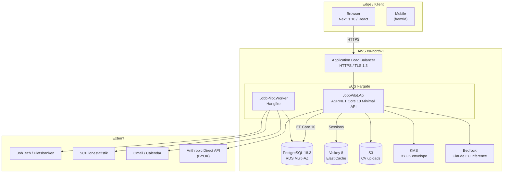
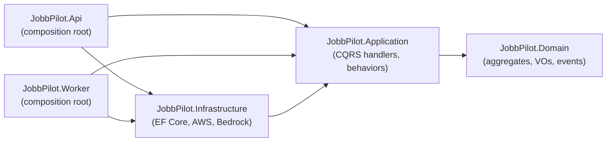

# JobbPilot

> **Svensk jobbansökningshanterare byggd som civic utility.**
> Platsbanken-integration, AI-assisterad CV/brev-skräddarsydning, end-to-end pipeline-tracker.
> EU-data-residens, GDPR-säker, Bring-Your-Own-Key för AI.

[](https://dotnet.microsoft.com/)
[](https://learn.microsoft.com/dotnet/csharp/)
[](https://nextjs.org/)
[](https://www.typescriptlang.org/)
[](https://www.postgresql.org/)
[](https://aws.amazon.com/)
[](docs/steg-tracker.md)
[](https://dev.jobbpilot.se/api/ready)
[](#licens)

---

## Snabblänkar

- [Vad är JobbPilot](#vad-är-jobbpilot)
- [Position och anti-position](#position-och-anti-position)
- [Funktioner](#funktioner)
- [Arkitektur](#arkitektur)
- [Kvalitet, test och coverage](#kvalitet-test-och-coverage)
- [Tech-stack](#tech-stack)
- [Komma igång lokalt](#komma-igång-lokalt)
- [Projekt-struktur](#projekt-struktur)
- [Vanliga kommandon](#vanliga-kommandon)
- [Miljöer](#miljöer)
- [Säkerhet och GDPR](#säkerhet-och-gdpr)
- [Status och roadmap](#status-och-roadmap)
- [Dokumentation](#dokumentation)
- [AI-driven utveckling](#ai-driven-utveckling)
- [Bidra](#bidra)
- [Författare](#författare)
- [Licens](#licens)

---

## Vad är JobbPilot

JobbPilot är en komplett jobbsök- och ansökningshanterare för den svenska arbetsmarknaden. Appen kombinerar JobTech/Platsbanken-integration med modern AI-assistans men positioneras medvetet som en *civic utility* — ett verktyg som signalerar tillit och pålitlighet snarare än hajp.

Målet är att stressade jobbsökare får ett verktyg som känns som en förlängning av svensk offentlig digital service (1177, Försäkringskassan, Digg) snarare än ett av hundra AI-produkter som alla ser likadana ut.

### Målgrupp

| Fas | Användare |
|-----|-----------|
| **v1 (primär)** | Aktiva jobbsökare i Sverige — initial kohort: produktägaren + ~20 klasskamrater på NBI/Handelsakademin |
| **v2** | Bredare svensk arbetsmarknad — tjänstemän, utvecklare, kunskapsarbetare. Freemium. |
| **framtid** | Internationella användare via `IJobSource`-adapters för NAV (Norge), Arbejdsformidlingen (Danmark), EURES (EU) |

---

## Position och anti-position

**JobbPilot är:**
- Svensk-först (Platsbanken, SCB, svensk rekryteringskultur)
- Kvalitet över volym — inga auto-apply-funktioner
- AI-assisterad där det ger tydligt värde, aldrig "AI-genererat för syns skull"
- GDPR-säker med äkta EU-datalokalisering (eu-north-1 Stockholm + Bedrock EU inference profile)
- Öppen för Bring-Your-Own-Key (BYOK) för AI

**JobbPilot är inte:**
- Ännu en ChatGPT-wrapper
- Ett mass-apply-verktyg som LoopCV eller Sonara
- En ATS-keyword-stuffer
- En jobbmarknad eller rekryteringstjänst

---

## Funktioner

Detaljerad scope finns i [`BUILD.md §2`](BUILD.md). Sammanfattning:

### Discovery

- Hämta platsannonser från **JobTech JobSearch API** (Platsbanken)
- Full-text-sökning och facetterad filtrering (region, yrke, SSYK, anställningsform, distans, datum)
- Sparade sökningar med notifieringsinställning per sökning
- **Taxonomi-baserad matchningsscore** (Fast mode) — gratis, beräknas för alla synliga annonser
- **LLM-baserad matchningsscore** (Deep mode) — på begäran, kostar credits
- Lönestatistik-overlay per annons från **SCB**

### Application management

- Full pipeline-tracker med state machine: Draft → Submitted → Acknowledged → InterviewScheduled → Interviewing → OfferReceived → Accepted / Rejected / Withdrawn / Ghosted
- Follow-up-loggning per ansökan (kanal, datum, anteckning, utfall)
- Kalenderintegration: Google Calendar + iCal-export
- Automatisk Ghosted-transition efter X dagar utan svar
- Avslags-analys med trender över tid

### AI-assistans

- **CV-parsing** från PDF/DOCX till strukturerad `ResumeContent` (PdfPig + OpenXml + Haiku LLM)
- **Skräddarsytt CV** per annons (Sonnet) — original behålls, ny versioned `ResumeVersion` skapas
- **AI-genererat personligt brev** (Sonnet) — på svenska, följer användarens skriv-DNA
- **Anti-klyscha-detektor** (Haiku) — markerar "brinner för", "driven team-player" etc. med förslag
- **Företagsresearch-brief** (Sonnet + web_search) — 1-pager med nyheter, teknik-stack, kulturell signal

### Integrationer

- Gmail-sync (OAuth) — auto-loggar ansökningssvar som Follow-Ups
- Google Calendar (OAuth) — intervjuer som events
- SCB lönestatistik — periodisk import per SSYK
- iCal-export av intervjuer

### Admin

- Användarhantering, suspendering, mjukradering
- **Impersonation** med audit-trail (`impersonating_by` claim, dubbel-taggning av handlingar)
- Token-användning per användare med kostnad över tid
- Audit-sökning och jobbkälla-statushälsa

---

## Arkitektur

JobbPilot följer **Clean Architecture** med strikt lager-separation och **DDD** med aggregates som invariant-skydd.



### Lager (.NET-backend)



**Regler:**
- `Domain` beror på **ingenting** — inga ORM, inga frameworks
- `Application` definierar interfaces; `Infrastructure` implementerar
- `Api` och `Worker` är komposition-rots — de bygger DI-containern

Mer detaljerat: [`BUILD.md §4`](BUILD.md), [`docs/decisions/`](docs/decisions/), [`CLAUDE.md §2`](CLAUDE.md).

---

## Kvalitet, test och coverage

JobbPilot byggs med en uttalad kvalitetsstandard: varje commit ska kunna försvaras i en kodgranskning på Mastercard-nivå. Det är inte en paroll utan en mätbar praxis.

### Test-disciplin

- **Clean Architecture-gränser verifieras maskinellt.** NetArchTest-regler i `JobbPilot.Architecture.Tests` failar bygget om Domain importerar EF Core, om Application känner till Infrastructure, eller om ett aggregat exponerar en publik setter.
- **Domänlogik testas utan databas.** Aggregat och value objects bär sina invarianter; handlers testas mot fake `IAppDbContext` med NSubstitute. Om något kräver en startad ASP.NET-host för att testas betraktas designen som fel (CLAUDE.md §2.4).
- **TDD där det bär.** Nya domäntyper och handlers får tester först; produktionskod skrivs för att passera.
- **Integrationstester mot riktig Postgres.** Testcontainers startar PostgreSQL 18.3 och Valkey per integrations-svit — ingen in-memory-attrapp som döljer provider-skillnader.
- **Granskningsspärrar utan PR-flöde.** Direct-push till `main` ([ADR 0019](docs/decisions/0019-solo-direct-push-to-main.md)) kompenseras av plan-design, STOPP-disciplin, specialiserade review-agenter med veto-rätt (code-reviewer, security-auditor, dotnet-architect), manuell diff-granskning och pre-push-hooks.

Backend-sviten omfattar **1 156 tester** (Domain, Application, Architecture, Api-integration, Worker, Migrate) — 0 failed.

### Coverage — reproducerbar, ärlig, regressionsskyddad

Coverage mäts av en **versionerad in-repo-mekanism** ([ADR 0044](docs/decisions/0044-test-coverage-policy.md)), inte en maskin-lokal ad-hoc-körning:

- `Microsoft.Testing.Extensions.CodeCoverage` (Microsoft, MTP-native, central via Central Package Management) samlar rå Cobertura per testprojekt — ofiltrerad, audit-trail bevarad.
- `dotnet-reportgenerator-globaltool` via in-repo tool-manifest producerar den first-party-filtrerade rapporten report-time. Rådatan förstörs aldrig — filtreringen är deklarativ och reversibel.
- Genererad kod (Mediator source-gen, OpenAPI), entrypoints (`Program.cs`, `JobbPilot.Migrate`) och migrationer filtreras bort så siffran speglar verklig testbar kvalitet, inte nämnar-kosmetik.
- En kommandorad reproducerar allt: `bash scripts/coverage.sh` (Windows: `scripts/coverage.ps1`).

First-party-resultat (samma mekanism, 1 156 tester gröna):

| Lager | Line | Branch | Method |
|-------|------|--------|--------|
| JobbPilot.Domain | 95,3 % | 93,3 % | 91,9 % |
| JobbPilot.Application | 97,7 % | 91,1 % | 98,1 % |
| JobbPilot.Infrastructure | 84,0 % | 71,1 % | 80,3 % |
| JobbPilot.Api (efter filter) | 93,7 % | 82,9 % | 92,3 % |
| JobbPilot.Worker | 30,7 % | observe-only | 36,8 % |
| **Totalt first-party** | **92,1 %** | **84,5 %** | **90,2 %** |

Siffrorna är medvetet asymmetriska: Domain och Application bär affärsinvarianter och har hög grentäckning; Worker är en tunn Hangfire-bootstrap vars jobblogik testas i Application-lagret. En global tröskel skulle dölja den asymmetrin — därför gejtar CI per lager.

### Regressions-gate (icke-regression-ratchet)

CI-jobbet `coverage` blockerar `main` om något lager faller under sitt golv. Golvet är `floor(uppmätt baseline − 2,0 pp)` — en absorptionsmarginal mot icke-deterministisk grenmätning som gör gaten trovärdig i stället för falsklarmande. Den är ett regressionsskydd, inte en måltavla (Fowler, Goodharts lag): golvet höjs manuellt när coverage stabilt ligger högre, aldrig automatiskt. Branch gejtas endast för Domain och Application — lagren som bär invarianter. Modell och pinnade golv: [ADR 0044](docs/decisions/0044-test-coverage-policy.md).

---

## Tech-stack

Versioner är låsta. Full lista i [`BUILD.md §3`](BUILD.md).

### Backend

| Komponent | Val | Version |
|-----------|-----|---------|
| Runtime | .NET | 10 (LTS) |
| Språk | C# | 14 |
| Framework | ASP.NET Core (Minimal API) | 10 |
| ORM | EF Core (Npgsql) | 10 |
| Mediator | `Mediator` (martinothamar) | 3.x |
| Validering | FluentValidation | 12.x |
| Mapping | Mapster | 10.x |
| Background jobs | Hangfire (Postgres-storage) | 1.8.x |
| Logging | Serilog | 4.x |
| Observability | OpenTelemetry | 1.15+ |
| AI (system-key) | AWSSDK.BedrockRuntime (Converse API) | 4.x |
| AI (BYOK) | Anthropic (officiell NuGet) | 12.x |
| PDF | PdfPig (parse) + QuestPDF (gen) | 0.1.14 / 2026.2 |

### Frontend

| Komponent | Val | Version |
|-----------|-----|---------|
| Framework | Next.js (App Router) | 16.2 |
| Språk | TypeScript (strict) | 6.0 |
| UI-komponenter | shadcn/ui | CLI v4 |
| Styling | Tailwind CSS | 4.2 |
| Server state | TanStack Query | 5.x |
| Tabeller | TanStack Table (headless) | 8.x |
| Forms | React Hook Form + Zod | RHF 7.72 / Zod 4.x |
| Auth-klient | NextAuth.js (Auth.js) | 5 |
| Datum | date-fns (svensk locale) | 4.x |
| Typografi | Hanken Grotesk (fallback Inter) | — |

### Datalager och infra

| Tjänst | Val |
|--------|-----|
| Databas | PostgreSQL 18.3 — AWS RDS Multi-AZ, eu-north-1 |
| Cache | Valkey 8 — AWS ElastiCache, eu-north-1 |
| Compute | AWS ECS Fargate (api + worker som separata services) |
| AI inference | AWS Bedrock EU cross-region inference profile (Claude Haiku 4.5 + Sonnet 4.6) |
| Object storage | AWS S3 — CV-uppladdningar, genererade dokument |
| Encryption | AWS KMS (master + BYOK envelope) |
| Frontend hosting | Vercel (EU) |
| DNS | Route 53 (`jobbpilot.se`) |
| Email | AWS SES (DKIM/SPF/DMARC) |
| Logs / metrics | CloudWatch + Seq (lokalt) |
| Errors | Sentry (EU datacenter) |
| Analytics | PostHog self-hosted (eu-north-1) |
| IaC | Terraform 1.14+ |
| CI/CD | GitHub Actions |

### Tester

| Verktyg | Användning |
|---------|------------|
| xUnit v3 | Test-runner |
| Shouldly | Assertions |
| NSubstitute | Mocks |
| Testcontainers | Postgres + Redis i integration-tests |
| NetArchTest.Rules | Architecture-tests |
| Playwright | E2E-frontend |
| Vitest | Unit-tests frontend |

---

## Komma igång lokalt

> Full setup-guide: [`docs/runbooks/local-dev-setup.md`](docs/runbooks/local-dev-setup.md)

### Förkrav

| Verktyg | Version | Installation (Windows) |
|---------|---------|------------------------|
| .NET SDK | 10.x | `winget install Microsoft.DotNet.SDK.10` |
| Node.js | 22 LTS | `winget install OpenJS.NodeJS.LTS` |
| pnpm | 10.x | `npm install -g pnpm` |
| Docker Desktop | Engine 28+ | `winget install Docker.DockerDesktop` |
| Git | senaste | `winget install Git.Git` |
| openssl | (lösenord-gen) | bundlat med Git for Windows |

### Första start

```bash
# 1. Klona
git clone https://github.com/klasolsson81/jobbpilot.git
cd jobbpilot

# 2. Generera lokala lösenord (PowerShell)
@"
POSTGRES_PASSWORD_DEV=$(-join ((48..57)+(65..90)+(97..122) | Get-Random -Count 32 | ForEach-Object {[char]$_}))
POSTGRES_PASSWORD_TEST=$(-join ((48..57)+(65..90)+(97..122) | Get-Random -Count 32 | ForEach-Object {[char]$_}))
REDIS_PASSWORD_DEV=
"@ | Out-File -Encoding utf8 .env

# 3. Starta Docker-stacken (Postgres, Valkey, Seq)
docker compose up -d

# 4. Verifiera
docker compose ps
docker exec jobbpilot-postgres-dev psql -U jobbpilot -d jobbpilot -tAc "SELECT version();"
docker exec jobbpilot-redis-dev redis-cli ping
```

### Backend

```bash
# Restore + build
dotnet restore
dotnet build

# Migrations (när du har en DbContext-ändring)
dotnet ef database update --project src/JobbPilot.Infrastructure --startup-project src/JobbPilot.Api

# Kör Api lokalt (port 5000/5001)
dotnet run --project src/JobbPilot.Api

# Kör Worker lokalt
dotnet run --project src/JobbPilot.Worker
```

### Frontend

```bash
cd web/jobbpilot-web

# Installera deps
pnpm install

# Kopiera env-mall
cp .env.example .env.local

# Dev-server (port 3000)
pnpm dev
```

### Verifierings-URL:er

| Tjänst | URL |
|--------|-----|
| Frontend | http://localhost:3000 |
| Api (HTTP) | http://localhost:5000 |
| Api (HTTPS, dev-cert) | https://localhost:5001 |
| Health-check | http://localhost:5000/api/ready |
| Seq (logs) | http://localhost:5341 |

---

## Projekt-struktur

```
jobbpilot/
├── src/
│   ├── JobbPilot.Domain/             # Aggregates, value objects, domain events
│   ├── JobbPilot.Application/        # CQRS handlers, pipeline behaviors, abstractions
│   ├── JobbPilot.Infrastructure/     # EF Core, AWS clients, Bedrock, Anthropic
│   ├── JobbPilot.Api/                # ASP.NET Core Minimal API, composition root
│   └── JobbPilot.Worker/             # Hangfire-server, schedulerade jobb
│
├── web/
│   └── jobbpilot-web/                # Next.js 16 App Router, shadcn/ui, Tailwind 4
│
├── tests/
│   ├── JobbPilot.Domain.UnitTests/
│   ├── JobbPilot.Application.UnitTests/
│   ├── JobbPilot.Worker.UnitTests/
│   ├── JobbPilot.Api.IntegrationTests/   # Testcontainers + WebApplicationFactory
│   └── JobbPilot.Architecture.Tests/     # NetArchTest-regler för lager-gränser
│
├── infra/
│   └── terraform/
│       ├── modules/                  # network, rds, redis, alb, ecs, route53, acm, ...
│       └── environments/
│           ├── prod/                 # Baseline-stack: KMS, CloudTrail, Route53, budgets
│           └── dev/                  # Lean dev-miljö
│
├── prompts/                          # AI-prompts som .prompt.md-filer
│
├── docs/
│   ├── current-work.md               # Single source of truth för session-state
│   ├── steg-tracker.md               # Långsiktig STEG-progression
│   ├── tech-debt.md                  # TD-register
│   ├── decisions/                    # ADR (Architecture Decision Records)
│   ├── reviews/                      # Auto-genererade agent-reviews
│   ├── runbooks/                     # Operativa procedurer
│   ├── sessions/                     # Per-session retrospektiv
│   └── research/                     # Investigationer, planer
│
├── .claude/                          # Claude Code agent-configs + skills + hooks
├── BUILD.md                          # Huvudspec — feature-scope, datamodell, integrationer
├── CLAUDE.md                         # Coding conventions för AI-assisterad utveckling
├── DESIGN.md                         # Design-system-index (specs i .claude/skills/)
└── docker-compose.yml                # Lokal Postgres + Valkey + Seq
```

---

## Vanliga kommandon

### Backend

```bash
# Bygg hela solutionen
dotnet build

# Kör alla tester (kan vara fragilt på solution-nivå — kör test-projekt direkt vid behov)
dotnet test

# Specifika test-suiter
dotnet test tests/JobbPilot.Domain.UnitTests
dotnet test tests/JobbPilot.Application.UnitTests
dotnet test tests/JobbPilot.Api.IntegrationTests
dotnet test --filter "Category=Architecture"

# Format-check (pre-commit hook kör detta automatiskt)
dotnet format --verify-no-changes

# Skapa migration
dotnet ef migrations add <Name> --project src/JobbPilot.Infrastructure --startup-project src/JobbPilot.Api

# Applicera migrations
dotnet ef database update --project src/JobbPilot.Infrastructure --startup-project src/JobbPilot.Api
```

### Frontend

```bash
cd web/jobbpilot-web

pnpm dev              # Dev-server med HMR
pnpm build            # Produktion-build
pnpm lint             # ESLint
pnpm test             # Vitest unit-tests
pnpm playwright test  # E2E-tests
```

### Infrastruktur (AWS)

```bash
# SSO-login (krävs varje session)
aws sso login --profile jobbpilot

# Plan + apply mot dev-stack
cd infra/terraform/environments/dev
terraform init
terraform plan -out=plan.out
terraform apply plan.out

# Outputs (cert-ARN, ALB-DNS, etc.)
terraform output
```

---

## Miljöer

| Miljö | Syfte | Deployment | Domän |
|-------|-------|------------|-------|
| `local` | Utveckling | Docker Compose | `localhost` |
| `dev` | Integration | Auto via tag `v*-dev` på `main` | `dev.jobbpilot.se` |
| `staging` | Pre-prod | Auto via tag `v*-rc*` på `main` | `staging.jobbpilot.se` |
| `prod` | Produktion | Manuell approval på tag `v*` | `jobbpilot.se` |

Branch-strategi: **direct-push till `main`** med Conventional Commits per [ADR 0019](docs/decisions/0019-solo-direct-push-to-main.md). Inga PR-flöden i nuvarande fas — granskningsspärrar via plan-design + agent-reviews + manuell diff-review + pre-commit/pre-push-hooks.

---

## Säkerhet och GDPR

JobbPilot är byggd för svensk arbetsmarknad och är därför **GDPR-säker by default**. Nyckel-höjdpunkter:

- **Datalokalisering:** all PII och alla AI-prompter med användardata stannar i EU. Bedrock används med EU cross-region inference profile (eu-central-1 + eu-west-1 fallback från eu-north-1)
- **Encryption at rest:** RDS + S3 + Secrets Manager + ElastiCache via AWS KMS (master-key)
- **Encryption in transit:** TLS 1.3 mellan klient och ALB ([ADR 0027](docs/decisions/0027-https-aktiverat-supersession.md)); HSTS 365 dagar + includeSubDomains; rds.force_ssl=1
- **BYOK:** användare kan koppla egen Anthropic-API-nyckel; den envelope-krypteras med separat KMS-key och syns aldrig i klartext utanför inference-anrop
- **Audit-trail:** alla state-transitioner i `Application`-aggregatet raisar domain events som lagras i `audit_log`. Impersonation dubbel-taggas
- **Art. 17 cascade:** soft-delete på primära aggregates triggar 30-dagars anonymisering ([ADR 0024](docs/decisions/0024-audit-retention-and-art17-cascade.md))
- **IP-anonymisering:** IPv4 /24 + IPv6 /48 i alla loggar
- **Loggretention:** 30 dagar standard (CloudWatch + Sentry)
- **Rate-limiting:** auth-write 20/min/IP, auth-loose 30/min/IP, account-deletion 1/60s/UserId
- **Subprocessor-kedja:** AWS (eu-north-1), Anthropic (Bedrock EU), Sentry (EU), PostHog self-hosted, Vercel (EU). Inga US-baserade processors för PII

Detaljer: [`BUILD.md §13`](BUILD.md), [`docs/decisions/0024-*`](docs/decisions/), [`docs/decisions/0017-*`](docs/decisions/).

---

## Status och roadmap

Aktuell status: **Fas 1 (Core Domain)** — Fas 0 stängd 2026-05-10.

Långsiktig planering följer en STEG-progression dokumenterad i [`docs/steg-tracker.md`](docs/steg-tracker.md). Aktuell session-state alltid i [`docs/current-work.md`](docs/current-work.md).

### Faser (övergripande)

| Fas | Innehåll | Status |
|-----|----------|--------|
| **Fas 0** | AWS-infrastruktur, container-pipeline, DNS + TLS, CI/CD | **Klar 2026-05-10** |
| **Fas 1** | Auth, kärn-CRUD, dashboard, JobTech-integration, basal AI | Pågående |
| **Fas 2** | Multi-tenant, OAuth, Gmail-sync, kalender | Planerad |
| **Fas 3** | Admin-yta, BYOK-onboarding, kostnadstak | Planerad |
| **Fas 4** | Public launch, betalning, internationell expansion | Framtid |

Live dev-miljö: [`https://dev.jobbpilot.se/api/ready`](https://dev.jobbpilot.se/api/ready) — auto-deploy via tag `v*-dev` på `main`.

Arkitektur-beslut historieförs som **ADRs** under [`docs/decisions/`](docs/decisions/) — index i [`docs/decisions/README.md`](docs/decisions/README.md).

---

## Dokumentation

| Fil | Syfte |
|-----|-------|
| [`BUILD.md`](BUILD.md) | Huvudspec — feature-scope, datamodell, API-design, integrationer, deployment |
| [`CLAUDE.md`](CLAUDE.md) | Coding conventions, anti-patterns, AI-utvecklings-workflow |
| [`DESIGN.md`](DESIGN.md) | Design-system-index — civic-utility-tone, design tokens, komponenter |
| [`docs/current-work.md`](docs/current-work.md) | Session-state, senaste commits, aktiv STEG |
| [`docs/steg-tracker.md`](docs/steg-tracker.md) | Långsiktig STEG-progression |
| [`docs/tech-debt.md`](docs/tech-debt.md) | TD-register med prioriteringar |
| [`docs/decisions/`](docs/decisions/) | Architecture Decision Records (ADRs) |
| [`docs/reviews/`](docs/reviews/) | Auto-genererade agent-reviews per STEG |
| [`docs/runbooks/`](docs/runbooks/) | Operativa procedurer (AWS-setup, lokal-dev, etc.) |
| [`docs/sessions/`](docs/sessions/) | Per-session retrospektiv-loggar |
| [`prompts/`](prompts/) | AI-prompts som versionerade `.prompt.md`-filer |

---

## AI-driven utveckling

JobbPilot byggs med **Claude Code** som primär utvecklings-partner. Workflow är dokumenterat i [`CLAUDE.md §9`](CLAUDE.md):

- **Plan-design:** webb-Claude och produktägaren designar scope och sekvens innan kod skrivs
- **STOPP-disciplin:** Claude Code halt vid varje övergång; ingen kod-skrivning eller commit utan explicit GO
- **Specialiserade agents:** code-reviewer, security-auditor, dotnet-architect, db-migration-writer, test-writer, adr-keeper, docs-keeper med veto-rätt vid relevant scope
- **Direct-push till `main`:** ingen PR-flow ([ADR 0019](docs/decisions/0019-solo-direct-push-to-main.md)). Granskningsvärdet ersätts av agent-reviews + manuell diff-granskning + pre-push hooks (gitleaks, dotnet format, lint-staged)
- **ADR-disciplin:** alla arkitekturbeslut historieförs i [`docs/decisions/`](docs/decisions/)
- **Session-protocol:** varje session börjar med [`docs/current-work.md`](docs/current-work.md) + senaste session-logg + git-log-verifiering

Claude Code-konfiguration ligger under [`.claude/`](.claude/):

| Path | Innehåll |
|------|----------|
| `.claude/agents/` | Subagent-definitioner (code-reviewer, security-auditor, ...) |
| `.claude/skills/` | Domain-specific skills (jobbpilot-design-tokens, jobbpilot-design-components, ...) |
| `.claude/hooks/` | Pre/post-tool-hooks (session-start, post-todo-review, ...) |
| `.claude/commands/` | Egna slash-kommandon |

---

## Bidra

Projektet är i pre-MVP-fas och drivs av en solo-utvecklare. **Externa bidrag accepteras inte i nuvarande fas.**

Om du ändå vill diskutera kod, arkitektur eller designval: öppna ett issue eller hör av dig direkt (kontakt nedan).

Vid framtida öppning för bidrag kommer fluxen att bytas från direct-push till PR-baserad — trigger för det är dokumenterad i [ADR 0019](docs/decisions/0019-solo-direct-push-to-main.md).

---

## Författare

**Klas Olsson**
.NET / fullstack-student, NBI/Handelsakademin Göteborg

- GitHub: [@klasolsson81](https://github.com/klasolsson81)
- Email: klasolsson81@gmail.com

---

## Licens

**Proprietär** — all rights reserved tills annat anges.

Detta repo är publikt synligt för portfölj-syfte men innehållet är inte fri programvara. Återanvändning, fork, eller derivat-arbete kräver explicit skriftligt godkännande från Klas Olsson.

Under v1 kommer projektet sannolikt att förbli proprietärt. När produkten lanserats publikt kommer en formell licens-policy att antas (övervägs: AGPL-3.0 för server-koden, MIT för shadcn-komponenter, separat ToS för hostad tjänst).

---

> _"Skriv som om varje commit ska kunna försvaras i en kodgranskning på Mastercard-nivå."_ — utdrag ur [`CLAUDE.md`](CLAUDE.md)
